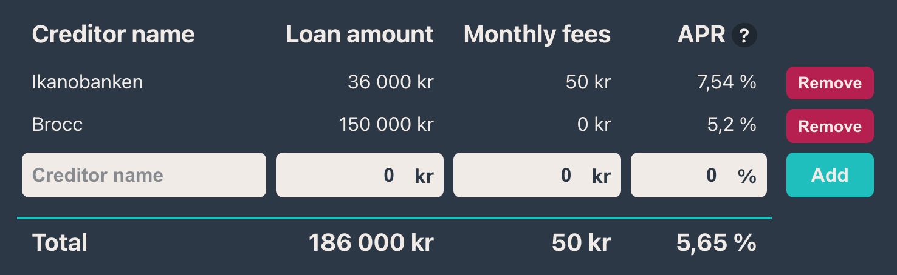

# React Loans Demo

This is a small React app that allows you to input and calculate your accumulated loan cost and annual percentage rate (APR). It was bootstrapped with [Create React App](https://github.com/facebook/create-react-app), and uses [Redux Persist](https://github.com/rt2zz/redux-persist) for remembering your data inputs between page loads.

## To run locally
Run `npm install` from the cloned repository to install all dependencies.

`npm start` runs the app in the development mode.\
Open [http://localhost:3000](http://localhost:3000) to view it in the browser.

*If you see a console error reading "action.rehydrate is not a function", [this odd StackOverflow suggestion](https://stackoverflow.com/a/52128658) may resolve it*
